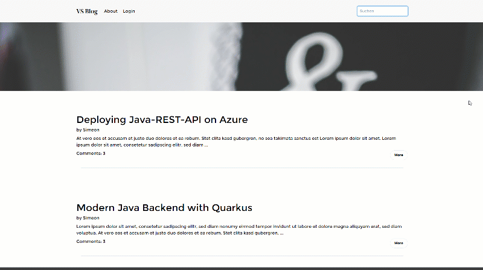
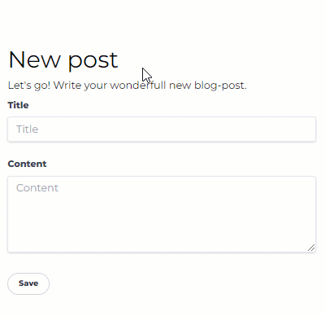

# Simple Blog Showcase with Quarkus Renarde with Qute, Unpoly and Tailwind CSS

## Including
- Responsive layout with Tailwind CSS
- Optimized UX with Unpoly (for partial page-loads)
- Simple Auth-Example with a JWT in a http-only Cookie (not from Renarde)

## Setup of the Keys for the JWT Part
During the Start of the Service, a key-pair for the authentification with the JWT-session-token is generated.
Don't use this approach in productive Environment with scaling. :-)

## Start in Dev-Mode
To get the app running in dev-mode, simply execute:
(**Warning**: Special Quarkus-Branch and Quarkus Renard should be builded according https://github.com/quarkiverse/quarkus-renarde) 

    ./mvnw quarkus:dev

http://localhost:8080

## How to use Unpoly in a Quarkus-Renarde Project  
Add unpoly-Dependency from webjars:  
    <dependency>
        <groupId>org.webjars.npm</groupId>
        <artifactId>unpoly</artifactId>
        <version>0.62.1</version>
    </dependency>
  
Add unpoly to your template:  
    
    <link rel="stylesheet" href="/webjars/unpoly/0.62.1/dist/unpoly.min.css">
  
### Small examples of the power of unpoly in this project  
#### Validate a form without reloading the hole page  
Add a selector in **up-target** for selecting the DOM-Part which you want to update: (found in `src\main\resources\templates\Login\login.html`)
    <form action="{uri:Login.loginrequest()}" method="POST" name="loginForm" up-target=".logindiv">
        ...
    </form>

#### Search on tiping:  
  

Just add **up-autosubmit**:  (found in `src\main\resources\templates\template.html`)
    <form method="GET" action="{uri:Application.index()}" up-target=".main-content" up-autosubmit>
        <input type="search" name="searchString" class="inp" placeholder="Search..">
    </form>

#### Validate one single form-element after leaving it  
  

Just add **up-validate** to your form-element:  
    <input class="inp" id="title" name="title" type="text" placeholder="Title" up-validate>

Ensure that you handle the **X-Up-Validate** header-param in your controller!

## How to use Tailwind CSS in a Quarkus-Renarde Project  

Install the Tailwind CLI over npm and execute a `init` according https://tailwindcss.com/docs/installation.  
Create a main-CSS file for example in `/src/main/resources/style.css` with the Tailwind directives and the style-definitions you like.  
Then you can build your CSS with the following command:

    npx tailwindcss -i ./src/main/resources/style.css -o ./src/main/resources/META-INF/resources/css/generated-tailwind.css

Integrate the CSS in your templates like this:

    <link href="/css/generated-tailwind.css" rel="stylesheet">
