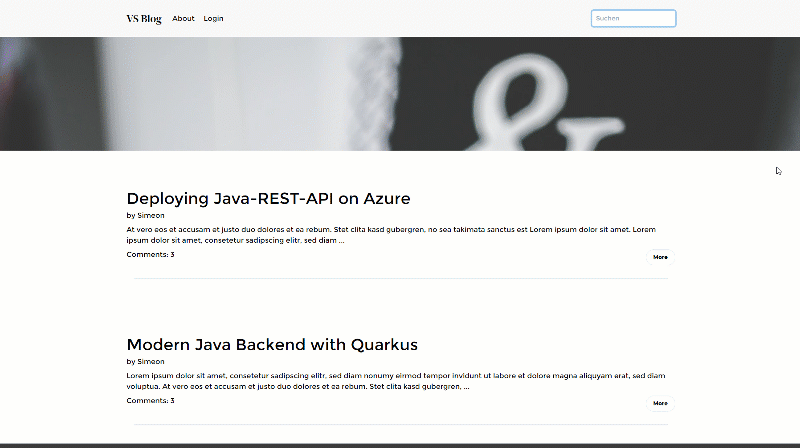

# Simple Blog Showcase with Quarkus Renarde with Qute, Unpoly and Tailwind CSS

## Including
- Responsive layout with Tailwind CSS
- Optimized UX with Unpoly (for partial page-loads)
- Simple Auth-Example with a JWT in a http-only Cookie (not from Renarde)

## Open Topics:  
- [ ] Test one-field form-validation with up-validate.
- [ ] Theme and Coloring Handling with tailwind css.
- [ ] Optimize paths in template (pages from subfolders are not loading images)
- [ ] Doc: Unpoly including, form-validation with unpoly, search on tipping with unpoly

## Warnings with Renarde:  
- [ ] WARNING: duplicate route registered for Post.post ?
- [ ] WARN Quarkus detected the use of JSON in JAX-RS method 'ch.hftm.vsblog.controllers.Login#login' but no JSON extension has been added.
- [ ] Unrecognized configuration key "quarkus.oidc.******.authentication.force-redirect-https-scheme" was provided; it will be ignored; verify that the dependency extension for this configuration is set or that you did not make a typo

## Issues with Renarde:  
- [ ] ifError and Error not working directly ({#ifError it='title'})
- [ ] Why is @Blocking necessary?
- [ ] Include Qute-Extenstion -> Error

## Setup of the Keys for the JWT Part
During the Start of the Service, a key-pair for the authentification with the JWT-session-token is generated.
Don't use this approach in productive Environment with scaling.

## Start in Dev-Mode
To get the app running in dev-mode, simply execute: 

    ./mvnw quarkus:dev

http://localhost:8080

# How to use Tailwind CSS in a Quarkus-Renarde Project  

Install the Tailwind CLI over npm and execute a `init` according https://tailwindcss.com/docs/installation.  
Create a main-CSS file for example in `/src/main/resources/style.css` with the Tailwind directives and the style-definitions you like.  
Then you can build your CSS with the following command:

    npx tailwindcss -i ./src/main/resources/style.css -o ./src/main/resources/META-INF/resources/css/generated-tailwind.css

Integrate the CSS in your templates like this:

    <link href="/css/generated-tailwind.css" rel="stylesheet">
